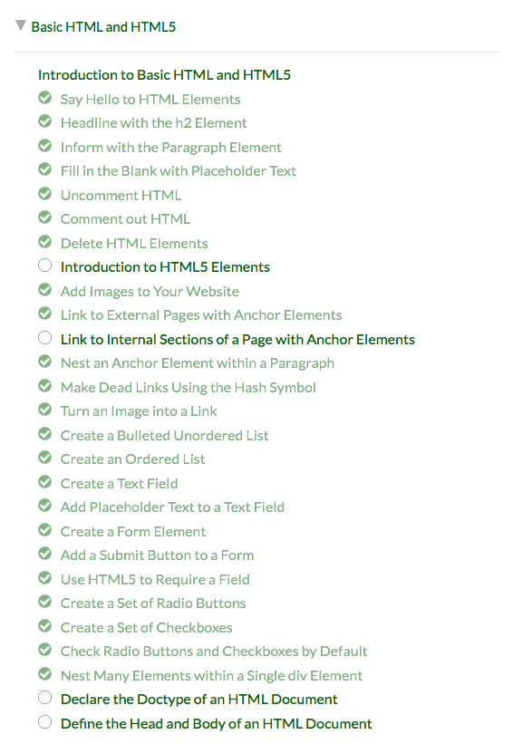

# Lesson #1: Editor and HTML Basics

## Editor

Um bom editor de texto será fundamental daqui para a frente, e neste momento a comunidade está toda no [Visual Studio Code](https://code.visualstudio.com), da Microsoft. 

É gratuito e tem milhares de temas/plugins, para além de já trazer muita coisa boa pré-instalada. Para além de instalares esse programa, deves instalar também uma extensão que diria que é fundamental para criação de sites: o [Live Server](https://marketplace.visualstudio.com/items?itemName=ritwickdey.LiveServer).

Tasks:

- Instalar VS Code;
- Instalar Live Server extension.

---

## HTML Basics #1

Como todo o conteúdo da página vai ser HTML, hoje vamos dedicar o dia a isto. Tudo o que seja parágrafos, imagens, formulários, temos que passar para HTML para que o *browser* consiga interpretar.

Vamos começar pelo [FreeCodeCamp](https://learn.freecodecamp.org) (tipo Codecademy) para entender os básicos.

Tasks:

- Cria uma conta no [FreeCodeCamp](https://learn.freecodecamp.org) e deverás começar logo no "Basic HTML and HTML5: Say Hello to HTML Elements".
- Completa o capítulo "Basic HTML and HTML5" (podes ver onde estás se clicares em "Curriculum", no cabeçalho).

Deverás ficar +/- assim, no final.

## HTML Basics #2

Com o que aprendeste no HTML Basics #1, cria uma página de raiz em que utilizes imagens, links, listas ordenadas, títulos e tudo o resto.

Abre o VS Code, e cria um `index.html` para começares. Para te facilitar, podes ativar o "Live Server" clicando em "Go Live", no rodapé, e assim sempre que fizeres *save* ao projeto no VS Code, o *browser* refresca sozinho com as alterações (se tiveres ecrã para isso, podes colocá-los lado a lado).

Tasks:

- Criar página de raiz com conteúdo original e usando os elementos básicos de HTML, com VS Code e Live Server.